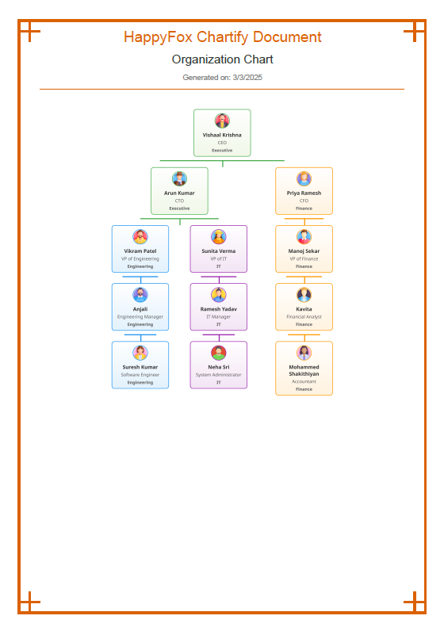

# Chartify - HappyFox Assignment 🦊

Chartify is an interactive employee organization chart visualization tool. It allows users to view, filter, and update the employee hierarchy dynamically with drag-and-drop functionality. Additionally, users can export the chart as a PDF.

## Features

- 🔍 **Employee List & Search**: Displays a list of employees with search and filter options.
- 📊 **Interactive Org Chart**: Visualizes the employee hierarchy based on manager relationships.
- 🔄 **Drag & Drop**: Allows users to change reporting structures by dragging and dropping employees.
- 🔌 **API Integration**: Supports fetching employee data from a mock API using PretenderJS.
- 📥 **Download as PDF**: Enables exporting the org chart as a PDF file.

## Assigned Chart Page


## Downloaded PDF Screenshot



## Installation

1. Clone the repository:
   ```sh
   git clone https://github.com/yourusername/chartify.git
   cd chartify
   ```

2. Install dependencies:
   ```sh
   yarn install
   ```

3. Navigate to the client folder and install frontend dependencies:
   ```sh
   cd client
   yarn install
   ```
   **Note:** ESLint dependencies may take some time to install.

4. Start the development server:
   ```sh
   yarn dev
   ```

The application will be available at `http://localhost:5173/`.

## Usage

1. View the employee list on the left panel.
2. Use the search bar and filters to find specific employees.
3. Drag and drop employees to change their reporting structure.
4. Click the "Download PDF" button to save the chart.

## Technologies Used

- **React.js**
- **SCSS** (for styling)
- **MUI (Material-UI)** (for UI components)
- **html2canvas & jsPDF** (for PDF export)
- **Pretender** (for API mocking)
- **React-Beautiful-DnD** (for drag-and-drop functionality)


